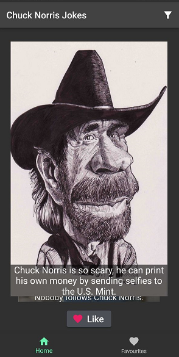

# Chuck Norris Jokes application project

Flutter project for Chuck Norris Jokes application.

## Application features

In this app you can:

- Read jokes about Chuck Norris.
- Like jokes.
- Swipe to the next joke.
- Enjoy photos and pictures of Chuck Norris.
- Save favourite jokes to favourite joke's list.
- Save jokes on your device or on firebase cloud.
- Use search filters to find more specific jokes.

All you need is just an internet connection!

### Demonstration:
<p float="left">
  
  
</p>


### Interface with features:
<p float="left">
  
  
  
  
</p>

Also if you want to uncheck all options except one in filter just do a long press on this option.

## Modification
Clone the repository and open it in Android Studio.
```bash
git clone https://github.com/Nagim123/NorrisJokes
```

## Android release

You can try the app yourself on Android. Just download the APK file from [this link](https://github.com/Nagim123/NorrisJokes/releases/download/v2.0.0/app-release.apk).
